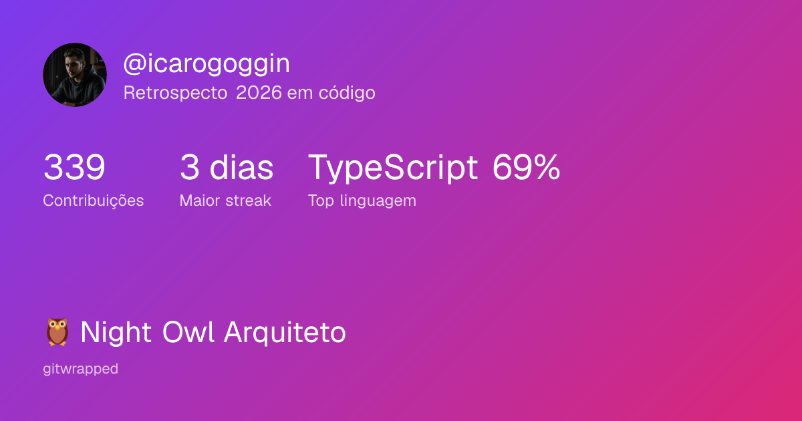
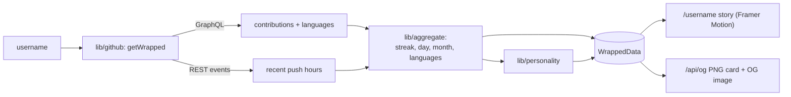

# GitWrapped 🎁

**Your year in code, Spotify-Wrapped style.** Paste a GitHub username and get an animated, shareable recap of the year — top languages, contributions, streak, coding schedule, and a fun "dev personality". Built to be shared: the recap doubles as an Open Graph image, so dropping the link on LinkedIn/X unfurls the card automatically.



<p>
  
  
  
  
</p>

---

## What it does

Give it any **public** GitHub username and it produces:

- **Top languages** — aggregated across the year's repositories (bytes → %).
- **Contributions & longest streak** — from the contribution calendar.
- **Busiest day & month** — when you ship the most.
- **Night-owl vibe** — approximate time-of-day of recent pushes (madrugada / manhã / tarde / noite).
- **Dev personality** — a playful label (🦉 Night Owl, 🔥 Streak Machine, 🐙 Polyglot…) derived from the stats.

It renders as a **5-slide animated story** at `/{username}` plus a downloadable **1200×630 PNG card** at `/api/og/{username}` that is also the page's OG image.

> The UI copy is in Brazilian Portuguese (`pt-BR`) and easy to localize — all strings live in `app/**` and `lib/aggregate.ts` / `lib/personality.ts`.

## Quick start

```bash
git clone https://github.com/icarogoggin/gitwrapped.git
cd gitwrapped
npm install

# A GitHub token is required (public data only). Easiest way:
cp .env.example .env.local
echo "GITHUB_TOKEN=$(gh auth token)" >> .env.local   # or paste a PAT with public/read scope

npm run dev        # http://localhost:3000
```

Open `http://localhost:3000`, type a username, and you're in. No account, no database.

## How it works



- **Data** comes from the GitHub **GraphQL** API (`contributionsCollection` for the calendar, `repositories.languages` for language bytes) plus the **REST** events endpoint for the recent time-of-day vibe. The token stays server-side and is never exposed to the client.
- **Pure aggregation** (streak, busiest day/month, language %, night-owl bucketing) lives in `lib/aggregate.ts` — framework-agnostic and fully unit-tested.
- Results are cached in-memory per `username:year` for 12h to protect the rate limit.

## Use it in your own project

Three practical ways to build on this:

**1. Embed the live card in your GitHub profile README.** Once deployed, the OG endpoint is a dynamic image — it updates itself:

```md

```

**2. Consume the JSON API** to power your own visualizations:

```
GET /api/wrapped/:username?year=2026
→ 200 WrappedData | 404 { error: "NOT_FOUND" | "NO_DATA" } | 500 { error }
```

**3. Reuse the aggregation library.** The stats engine is decoupled from the UI — lift it into any Node/TS project. Set `process.env.GITHUB_TOKEN` and:

```ts
import { getWrapped } from "@/lib/github";

const data = await getWrapped("torvalds");        // current year
const data = await getWrapped("torvalds", 2025);  // specific year
// data.languages, data.totalContributions, data.longestStreakDays,
// data.busiestWeekday, data.nightOwl, data.personality, ...
// throws Error("NOT_FOUND" | "NO_DATA" | "NO_TOKEN" | "GH_API")
```

Or use the pure helpers directly (no network, no token):

```ts
import { longestStreak, topLanguages, nightOwlVibe } from "@/lib/aggregate";
```

## Deploy (Vercel)

1. Import the repo at [vercel.com/new](https://vercel.com/new).
2. Set environment variables:
   - `GITHUB_TOKEN` — a PAT with public/read scope.
   - `NEXT_PUBLIC_SITE_URL` — your deployment URL (e.g. `https://gitwrapped.vercel.app`). **Required** so the OG image resolves to an absolute URL and unfurls correctly on LinkedIn/X.
3. Deploy, then post `https://<your-url>/<username>` on LinkedIn — the card appears in the preview.

## Customizing

- **Slides** — edit `buildSlides()` in `app/[username]/Story.tsx` (colors, order, copy, add a slide).
- **Personality labels** — the rule table in `lib/personality.ts` (priority-ordered; first match wins).
- **The card** — `app/api/og/[username]/route.tsx` (built with `next/og`).
- **Which stats** — extend `WrappedData` in `lib/types.ts` and the aggregation in `lib/aggregate.ts` / `lib/github.ts`.

## Project structure

```
app/
  page.tsx                     landing (username input)
  [username]/page.tsx          story page (server: fetch + OG metadata)
  [username]/Story.tsx         5 animated slides (client, Framer Motion)
  api/wrapped/[username]/      JSON endpoint
  api/og/[username]/           PNG card / OG image (next/og)
lib/
  github.ts                    getWrapped: GraphQL + REST -> WrappedData (+ cache)
  aggregate.ts                 pure stat functions (tested)
  personality.ts               dev-personality rules (tested)
  cache.ts                     in-memory TTL cache (tested)
  types.ts                     WrappedData contract
```

## Tech stack

Next.js 16 (App Router) · React 19 · TypeScript · Tailwind CSS v4 · Framer Motion · `next/og` · Vitest.

## Testing

```bash
npm test          # 18 tests, offline (fetch is mocked)
```

Coverage focuses on the logic that matters: streak computation, language aggregation, day/month, night-owl bucketing, personality rules, cache TTL, and the `getWrapped` composition against a mocked GitHub API.

## Roadmap

- [ ] Spotify-Wrapped visual overhaul (bold per-slide grounds, oversized type, ranked capsule bars, comic-burst personality).
- [ ] Multi-year support (`?year=` is already wired end-to-end).
- [ ] Exact night-owl (full-year commit timestamps, cached) instead of the recent-events approximation.
- [ ] LLM-generated personality as an opt-in.

## Contributing

Small, focused codebase with clear boundaries and unit tests — PRs welcome. Keep new logic in `lib/` pure and tested; keep UI copy localizable.

## License

MIT © [Ícaro Goggin](https://github.com/icarogoggin)
